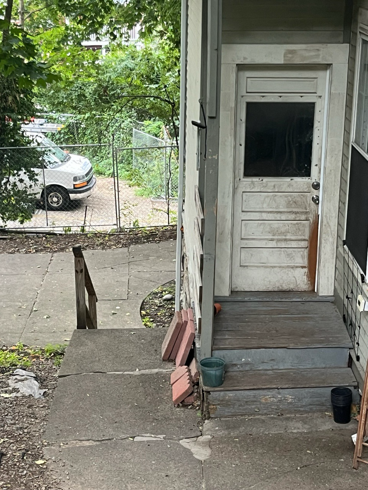

# Neighborhood Opposition to City Realty's 18 Robeson St Proposal

## Executive Summary
This document outlines the central elements of the community’s opposition to City Realty's development proposal for a new single-family structure at the rear of 18 Robeson Street.  The positions outlined here are supported by residents of the immediate neighborhood and the wider community. The community’s opposition to this project is based on impacts to the community (especially abutters), potential structural damage and other negative impacts to surrounding properties, environmental impacts, lack of counterbalancing benefits to the community or the City, the developer's poor track record, and zoning concerns.

## Key Opposition Points

### 1. Non-Buildable Lot Status
- The rear of 18 Robeson is a non-buildable lot.
- City Realty has attempted for 12 years to overcome zoning challenges
- City Realty recorded a sub-division plan for a new (non-conforming) lot in 2018, to be known as “21 Rocky Nook Terrace”
- The current proposal is to carve out a section of the 18 Robeson Parcel and construct a new residential structure on it
- Current proposal includes a convoluted single-family condo arrangement
- The “18R” lot is not comparable to 16R Robeson Street in size
- The 16R lot was deeded separately to the owner of 16 Robeson

### 2. Construction and Environmental Concerns
- High risk of damage to 100+ year old nearby houses built on puddingstone ledge
- Removal of multiple mature trees, including destruction of the largest tree on 22 Robeson St
- Loss of habitat and privacy for surrounding properties
- Excessive building size (50' wide by 24' deep x 30'+ high) on a small parcel
- Proposed building would be less than 30' from the side walls of 17 Rocky Nook Terrace
- Potential drainage issues affecting downhill properties due to disturbance of a natural aquaduct running through the puddingstone cliff

### 3. Developer's Poor Track Record
- City Realty has been a troublesome neighbor
- Refused to remove deteriorated, dangerous barn for years
- Inspectional Services failed to enforce removal requirements for many years
- When finally forced to remove the barn due to hazardous conditions, created new hidden hazardous conditions on lot
- Created or allowed hazardous conditions to remain on the property for more than a decade
- Property maintenance issues including trash accumulation and parking lot deterioration
- Widely known reputation for misrepresentations, shoddy construction, poor maintenance, etc.
- Unreliable and misleading plans regarding construction program, parking, slope assessment, and rear staircase

### 4. Lack of Community Benefit
- No compelling purpose beyond developer profit
- Does not address City’s need for affordable housing

### 5. United Neighborhood Opposition
- Residents are united in opposition to this development

## Detailed Concerns

### Building Size and Positioning
- Structure would be 50' x 24' x 30.5', occupying the maximum space permissible by zoning
- Minimum setbacks in all directions
- Building would be extremely close to 17 Rocky Nook Terrace
- Property line will be just 7 feet from the adjacent 22 Robeson St property

### Retaining Wall Issues
- Retaining wall will be only 2-3 feet from the property line
- See reference sheets A-2.1 and A-3.01

### Tree and Environmental Impact
- Further loss of privacy for Rocky Nook and Robeson Street residents
- Additional density, with associated noise, parking and other issues
- No clear drainage plan; disruption of natural aquaduct running through the puddingstone hill
- Likely drainage issues for 16 and 16 R Robeson, as well as 17 Rocky Nook Terrace

### Terrain and Site Plan Concerns
- Low confidence in City Realty's depiction of the building and site layout
- Misrepresentation of the terrain and steep slope of pudding rock along the property line
- Plans fail to show terrain beyond the retaining walls (see sheets A-3.00, A-3.01, A-3.02, A-2.1)
- Unclear handling of slope between building and 17 Rocky Nook parcel
- Maximum elevation shown as 114', but this appears to be at the retaining wall, not the property line
- Sheet A-3.02 shows elevation maxing at 114' behind parking area, falling short of property line

### Access and Infrastructure Issues
- City Realty apparently intends to remove existing concrete staircase leading from driveway to rear entrance
- No clear plan for how occupants will access the parking area
- Sheet A-2.4 appears to misrepresent the situation by showing stairs that cannot coexist with the parking plan
- Unexplained fence/handrail along retaining wall adjacent to parking area (Sheet A-3.02)
- Parking on a steep slope (3.5-4' height difference over ~20')
- No clear drainage plan for parking area, creating risk of water pooling or redirecting toward 16R Robeson
- Questionable plans to build above ledge without removing rock/ledge

## Community Perspective
Every other residential building in this neighborhood is owner-occupied. City Realty's persistent attempts to extract profit from this parcel highlights the difference between resident homeowners who want to improve the community and developers who prioritize profit over community impact.

## Neighborhood Signatories

The following residents have signed on to this opposition presentation:

### Abutting Properties

- **Clare Conley** - 17 Rocky Nook Terrace (Abutter)
- **Ethan Cole** - 17 Rocky Nook Terrace (Abutter)
- **Marilyn Arsem** - 14 Rocky Nook Terrace (Abutter)
- **Glenda Yoder** - 22 Robeson Street (Abutter)
- **Freida Yoder** - 22 Robeson Street (Abutter)

### Rocky Nook Terrace Residents

- **Gabriel Rice** - 6 Rocky Nook Terrace
- **Deborah Boldin** - 6 Rocky Nook Terrace
- **Eric Rosenthal** - 10 Rocky Nook Terrace
- **Jessica Talamas** - 11 Rocky Nook Terrace
- **Julia Halperin** - 11 Rocky Nook Terrace
- **Jason Cortlund** - 11 Rocky Nook Terrace
- **Mel Rico** - 11 Rocky Nook Terrace
- **Jasper Sanchez** - 14 Rocky Nook Terrace
- **Keith Becker** - 14 Rocky Nook Terrace
- **Geoff Pfeifer** - 15 Rocky Nook Terrace
- **Molly Below** - 15 Rocky Nook Terrace
- **Beth Abelow** - 15 Rocky Nook Terrace
- **Jerry Abelow** - 15 Rocky Nook Terrace

### Glen Road Residents

- **Birgit Hartje** - 43 Glen Road
- **Mary (Marie) Regan** - 46 Glen Road
- **Kathy Evans** - 52 Glen Road
- **Jon Mangat-Rai** - 52 Glen Road

### Robeson Street Residents

- **Adam Smith** - 12 Robeson Street
- **David Nichol** - 12 Robeson Street
- **Sarena Nichol** - 12 Robeson Street
- **Rita Jo Horsley** - 16 Robeson Street
- **Sean Pulsfort** - 26 Robeson Street
- **Ross Kochman** - 26 Robeson Street
- **Justin Kehoe** - 26 Robeson Street
- **Molly Seamans** - 26 Robeson Street
- **Carol Marton** - 30 Robeson Street

### Tenants of 18 Robeson Street

- **Wiley Spears** - 18 Robeson Street
- **Casey Stewart** - 18 Robeson Street
- **Sophia Samaha** - 18 Robeson Street
- **Madeline Evans** - 18 Robeson Street
- **Fatima Tourk** - 18 Robeson Street
- **Adele Andrews** - 18 Robeson Street
- **Anastasia Barrett** - 18 Robeson Street
- **Tyler Passerine** - 18 Robeson Street
